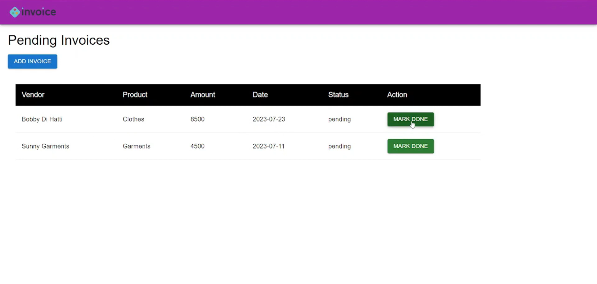
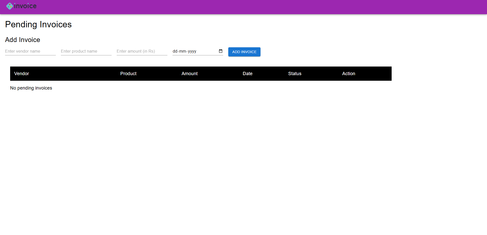

# Invoice-Processing-System
The Invoice Processing System is a full-stack web application designed to manage and process customer invoices efficiently. It allows users to create, view, update, and delete invoices, with real-time status updates. The application is built using React for the frontend and Spring Boot with Hibernate for the backend, connected to a MySQL database for persistent storage.

# Features
* Add new invoices
* View all invoices
* Mark invoice as Paid
* Delete invoice
* REST API integration
* MySQL database storage
* Full CRUD operations

# Tech Stack
**Frontend**
* React.js
* Axios
* HTML5
* CSS3

**Backend**
* Java
* Spring Boot
* Spring Data JPA (Hibernate)
* REST APIs

**Database**
* MySQL

# Screenshots

